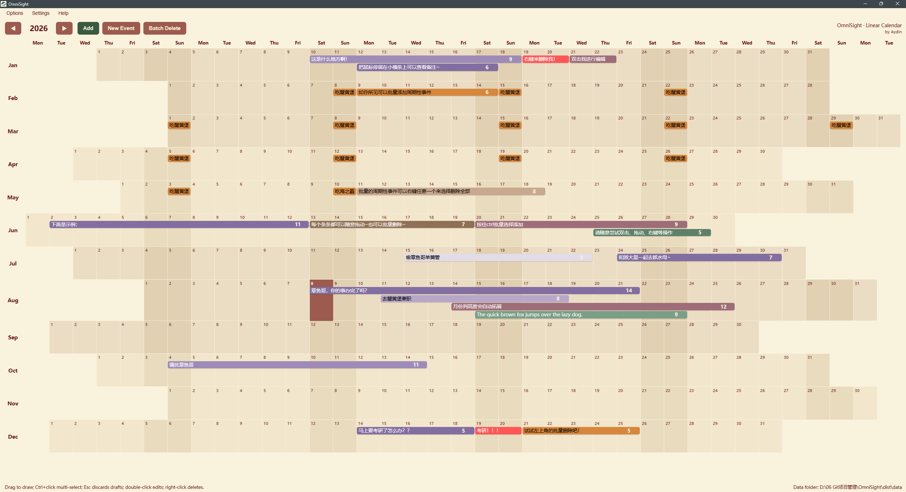
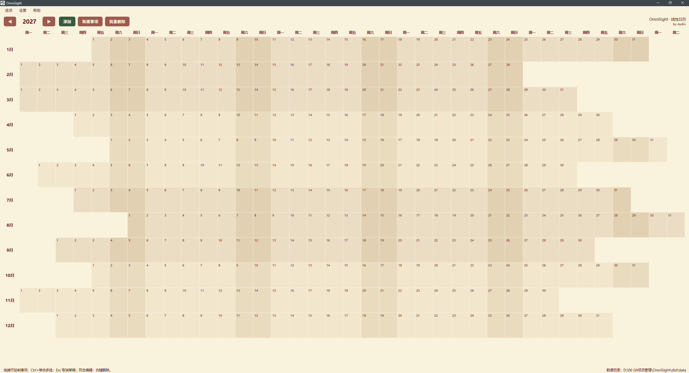
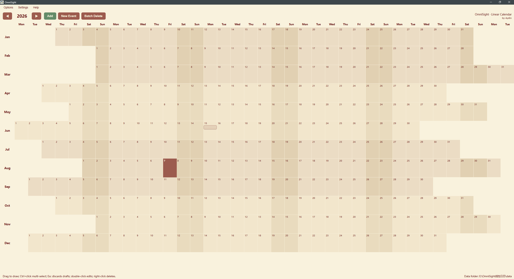
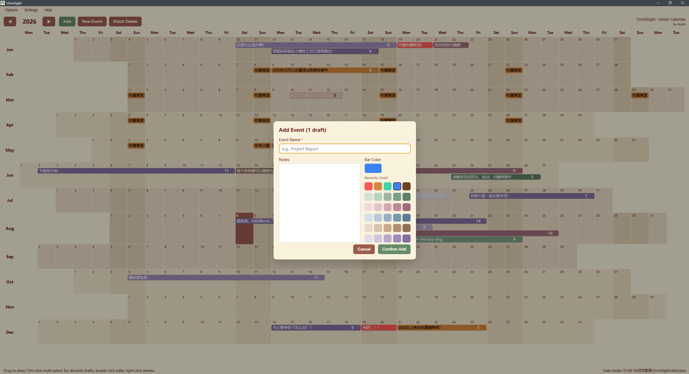
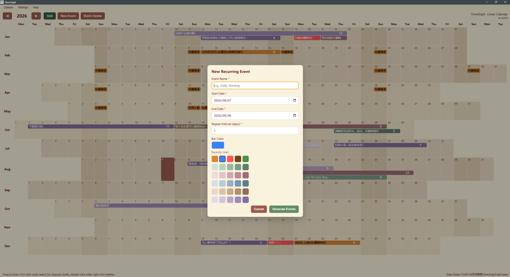

# OmniSight · 线性日历 (Linear Calendar)

> 一款 Windows 桌面线性年历应用 —— 一年一页，纵览全年。
> A Windows desktop linear annual calendar — the whole year on one page.

---

## 简介 / Introduction

**中文**：OmniSight 是一款基于 Electron 的 Windows 桌面日历软件，采用「线性年历」布局：12 个月纵向排列，横向固定 37 列（周一~周日循环），整年在一个可滚动的页面内完整呈现。软件支持跨天连续事项、周期批量事项、拖拽绘制、批量删除、悬浮预览、双击编辑与本地按年份存储，适合用于年度规划、阶段目标、周期性任务和长期事项管理。

**English**: OmniSight is an Electron-based Windows desktop calendar app built around a **linear annual layout**: 12 months are stacked vertically across a fixed 37-column weekday grid (Mon–Sun cycling), so the entire year fits on a single scrollable page. It supports cross-day continuous events, recurring batch events, drag-to-draw creation, batch deletion, hover previews, double-click editing, and per-year local storage — ideal for annual planning, phase goals, recurring routines, and long-term milestones.

## 核心设计理念 / Core Design Concept

**中文**：与传统「月历/周历」不同，OmniSight 把全年日期一次性铺开：纵向是 12 个月，横向是固定的周循环列组，年份之间数据相互隔离。这种布局让全年的计划分布一目了然，无需翻页即可规划长期目标、阶段计划、周期任务与跨天连续事项。

**English**: Unlike traditional monthly/weekly calendars, OmniSight lays out the whole year at once — 12 months vertically, a fixed weekday grid horizontally, with each year's data stored separately. This makes your year-long plan visible at a glance, so you can arrange long-term goals, phased plans, recurring routines, and multi-day events without paging around.

## 截图展示 / Screenshots

**中文**：以下为软件主要界面截图（截图中数据均为演示示例，非真实日程）。

**English**: Screenshots of the main interfaces below (all data shown is demo content, not real schedules).

### 全年总览视图 / Year Overview

**中文**：12 个月纵向排列、横向固定 37 列网格；事项以彩色横条覆盖对应日期区间，全年计划一目了然。

**English**: 12 months stacked vertically on a fixed 37-column weekday grid; events appear as colored bars spanning their date ranges, so the whole year is visible at a glance.

### 空白年度视图 / Empty Year View

**中文**：新的一年的干净网格，点击任意日期格即可开始规划。

**English**: A clean grid of a brand-new year — click any date cell to start planning.

### 添加与编辑事项弹窗 / Add-Event & Edit-Event Dialog

**中文**：双击草稿条或点击「添加」弹出表单，填写名称、备注并选择颜色；颜色面板包含「最近使用」与 5 组预设色板。在编辑页面可直接更改事项条长度。

**English**: Double-click a draft bar or press "Add" to open the form — fill in the name, notes, and pick a color; the picker includes recently used colors and 5 preset palettes.You can directly modify the length of the event bar on the edit page.

### 新建周期事项弹窗 / Recurring-Event Dialog

**中文**：按起始/结束日期与重复间隔天数批量生成周期事项，并可同时设置颜色。

**English**: Batch-generate recurring events by start/end date and repeat interval, with a color chosen at the same time.

## 功能特性 / Features

| 功能 / Feature | 说明 / Description                                                                                                                                                                                             |
| -------------- | -------------------------------------------------------------------------------------------------------------------------------------------------------------------------------------------------------------- |
| 全年单页视图   | 12 个月纵向排列、固定 37 列网格，垂直滚动，不分页。Full-year single-page view with a fixed 37-column grid.                                                                                                     |
| 年份切换       | 上一年/下一年按钮；数据按年份分文件夹隔离。Year switching with per-year isolated data.                                                                                                                         |
| 拖拽绘制草稿   | 单击或拖拽生成虚线草稿条；Ctrl+单击多选；点击空白/Esc 作废；双击草稿条直接弹出添加。Dashed draft bars via click/drag; Ctrl+click multi-select; Esc or click-elsewhere to discard; double-click a draft to add. |
| 跨天连续横条   | 同月跨格连续、跨月分段延续；一条事项是一个整体对象，可整体编辑/移动/删除。Continuous cross-day/month bars as single objects.                                                                                   |
| 泳道堆叠       | 同一日期多条事项自动分泳道堆叠，互不遮挡；不重叠事项共享同一泳道。Lane-based stacking without overlap.                                                                                                         |
| 周期批量事项   | 按名称、起止日期、间隔天数批量生成；保留系列关联，可整体编辑/删除。Recurring batch events with series linkage.                                                                                                 |
| 悬浮预览       | 悬停横条显示完整名称、备注与日期。Hover preview shows full name, notes, and dates.                                                                                                                             |
| 编辑与删除     | 双击编辑文字/颜色；右键删除单条或整条；拖动整条移动。Double-click to edit; right-click to delete; drag to move.                                                                                                |
| 批量删除       | 顶部「批量删除」进入多选模式，单击多选横条，完成/取消。Batch-delete mode with multi-select.                                                                                                                    |
| 颜色系统       | 自绘光谱面板 + 最近使用 5 色 + 5 组预设色板，在添加/新建/编辑弹窗统一可用。Custom spectrum picker, recent colors, and 5 preset palettes.                                                                       |
| 本地存储       | JSON 文件按年份保存，重启不丢失。Local JSON storage per year; data survives restarts.                                                                                                                          |

## 界面与操作 / Usage

### 顶部工具栏 / Top Bar

**中文**：

- **◀ / ▶**：切换上一年 / 下一年
- **添加**：把当前虚线草稿正式提交为事项（弹出名称/备注/颜色表单；双击草稿条效果相同）
- **新建事项**：批量生成周期事项（名称、起始年月日、结束年月日、重复间隔天数）
- **批量删除**：进入多选模式，此时按钮切换为「完成 / 取消」

**English**:

- **◀ / ▶**: Switch to the previous / next year
- **添加 (Add)**: Commit the current dashed drafts as real events (opens a name/notes/color form; double-clicking a draft bar does the same)
- **新建事项 (New Event)**: Generate recurring events in batches (name, start date, end date, repeat interval in days)
- **批量删除 (Batch Delete)**: Enter multi-select mode; the buttons switch to "Done / Cancel"

### 创建事项 / Creating Events

**中文**：

1. 单击某个有效日期格 → 生成该日的单日虚线草稿条；横向拖拽 → 生成跨天草稿条（可跨月）
2. 按住 `Ctrl` 多次单击 → 追加多条独立单日草稿
3. 点击页面空白处或按 `Esc` → 草稿全部作废
4. 点击「添加」或双击草稿条 → 填写名称、备注、颜色并确认 → 草稿转为实体横条

**English**:

1. Click a valid date cell to create a single-day dashed draft; drag horizontally to create a cross-day draft (months can be crossed)
2. Hold `Ctrl` and click multiple cells to append several independent single-day drafts
3. Click blank space or press `Esc` to discard all drafts
4. Click "Add" or double-click a draft bar, fill in name / notes / color, and confirm — the draft becomes a solid bar

### 管理事项 / Managing Events

**中文**：悬停横条查看完整信息；双击横条编辑名称/备注/颜色（周期系列可整条修改）；右键删除单条或整条序列；按住左键拖动整条平移（可跨月/跨年）；「批量删除」模式下单击多选后点「完成」一次性删除。

**English**: Hover a bar to preview full details; double-click to edit name/notes/color (series can be edited as a whole); right-click to delete a single item or an entire series; drag a bar to move it (across months/years); in batch-delete mode, click to multi-select bars and press "Done" to delete them all at once.

### 周期事项说明 / Recurring Events

**中文**：「新建事项」按起始日期起每隔 N 天生成一个单日事项，直到结束日期（含首尾）。生成条目与手动绘制条目外观一致，并保持系列关联，可对整条系列统一编辑或删除。

**English**: "New Event" generates single-day items every N days from the start date through the end date (inclusive). Generated items look identical to manually drawn ones and stay linked as a series, allowing whole-series edits or deletion.

## 技术栈 / Tech Stack

- **框架 / Framework**: Electron（HTML / CSS / Vanilla JavaScript）
- **运行时 / Runtime**: Node.js（本地文件读写）
- **目标平台 / Target Platform**: Windows 10 / Windows 11

## 安装与运行 / Installation & Running

**中文**：

1. 克隆仓库到本地
2. 确保已安装 Node.js
3. 运行 `npm install` 安装依赖
4. `npm start` 启动开发版；`npm run build` 打包便携版 exe（产物在 `dist/`）

**English**:

1. Clone the repository
2. Make sure Node.js is installed
3. Run `npm install` to install dependencies
4. Run `npm start` for development, or `npm run build` to package a portable `.exe` (output in `dist/`)

## 数据存储 / Data Storage

**中文**：所有日历数据以 JSON 文件保存在应用数据目录（便携版为 exe 所在目录，开发版为项目根目录）下的 `data/<年份>/items.json`，按年份分文件夹隔离；「最近使用颜色」保存在 `data/recent-colors.json`。备份或迁移时直接复制整个 `data` 文件夹即可。

**English**: All calendar data is stored as JSON files under the app data directory (`data/<year>/items.json`, where the data folder sits next to the portable exe or in the project root for development), isolated by year. Recently used colors are saved in `data/recent-colors.json`. To back up or migrate, simply copy the whole `data` folder.

## 许可证 / License

MIT License

## 维护与更新 / Maintenance & Roadmap

**中文**：作者（AydinRW）将在 **2027 年继续维护并更新本软件**，后续计划包括：自定义主题、其他语言、新增板块（类似于看板）、月度/周度/日度视图、事项列表与统计、快捷键自定义与快捷键缩放等。欢迎通过 GitHub Issues 提交建议与反馈。

**English**: The author (AydinRW) **will continue to maintain and update this software in 2027**. Planned improvements include custom themes, additional languages, new sections (similar to the spectaculars board), monthly/weekly/daily views, item List and Statistics, shortcut customization and shortcut-based zoom, and more. Suggestions and feedback are welcome via GitHub Issues.
